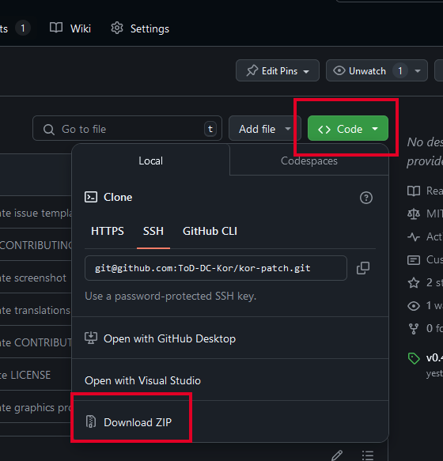
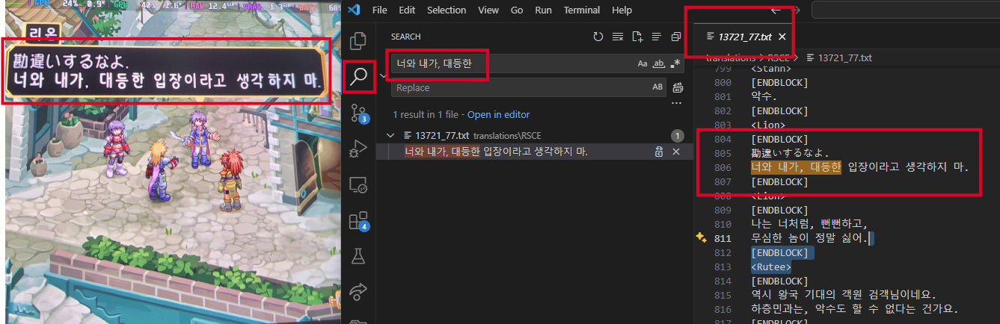
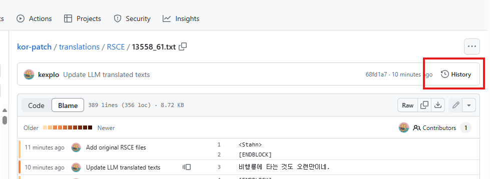
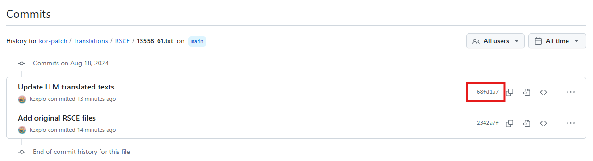
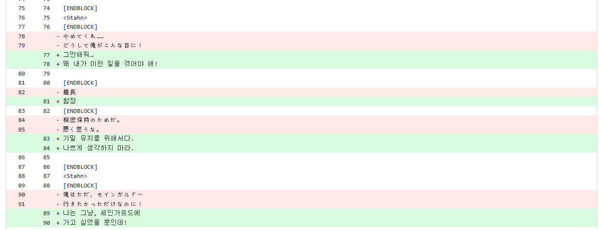

# 프로젝트에 기여하기

다음과 같은 방법으로 프로젝트에 기여하여 패치 제작에 참여할 수 있습니다.

- 도움 이슈에 기여하기
- 게임 플레이 후 화면에 잘못 표기되는 번역 문자열 [이슈](https://github.com/ToD-DC-Kor/kor-patch/issues/new/choose) 제보
- 번역 오류/교정 제보 또는 Pull Request(PR) 작성

## 도움 이슈에 기여하기

Issues에서 [🐤 help wanted](https://github.com/ToD-DC-Kor/kor-patch/issues?q=sort%3Aupdated-desc+is%3Aissue+is%3Aopen+label%3A%22%F0%9F%90%A4+help+wanted%22) Label이 달린 항목을 클릭하여 도움이 필요한 이슈를 확인하고 기여해보세요.

## 텍스트 오류 제보

플레이 중 번역 오류, 글자 깨짐, 줄바꿈 이상, 글자 넘침 등을 발견하면 [이슈](https://github.com/ToD-DC-Kor/kor-patch/issues/new/choose)로 제보해주세요.

제보 방법은 다음과 같습니다.

1. [VS Code](https://code.visualstudio.com/download)를 다운받아 설치합니다.

2. <https://github.com/ToD-DC-Kor/kor-patch>에서 저장소의 최신 버전을 다운로드 받습니다.

   

3. 다운받은 저장소의 압축을 풀고, VS Code로 해당 폴더를 엽니다.

4. 검색 메뉴를 통해, 번역 오류의 위치를 찾습니다. 근처에 같이 출력되는 정상 문자열을 검색합니다.

   
   (예시: `13721_77.txt` 파일의 `805` 줄 번역 오류)

5. [이슈](https://github.com/ToD-DC-Kor/kor-patch/issues/new/choose)로 문제가 발생한 스크린샷 또는 번역 오류의 위치(파일명, 줄 번호)를 제보합니다.

## 번역 교정

### RSCE 번역 수정에 대해 Pull Request(PR) 작성하기

1. GitHub Desktop 등을 사용하여 저장소를 로컬에 내려 받습니다.
[GitHub Desktop 설치 도움말](https://docs.github.com/ko/desktop/installing-and-authenticating-to-github-desktop/setting-up-github-desktop).
2. [VS Code](https://code.visualstudio.com/download) 등의 도구를 사용하여 RSCE 파일을 수정합니다. (메모장을 사용하지 마세요)
3. 수정이 완료되면 GitHub Desktop 등을 사용하여 변경사항을 Commit으로 만들고 Push합니다.
4. GitHub 웹에서 Pull Request(PR)를 생성합니다. [GitHub Pull Request 도움말](https://docs.github.com/ko/pull-requests/collaborating-with-pull-requests/proposing-changes-to-your-work-with-pull-requests/creating-a-pull-request).

### RSCE 원문과 번역 비교하기

원문의 확인이 필요할 경우, Git 저장소의 Commit history를 통해 확인할 수 있습니다.

#### Git에 익숙하지 않은 경우

- [GitHub File Diff](https://chromewebstore.google.com/detail/github-file-diff/lmhbkinmjbfihpkihjdhcagnigpklinh?pli=1) Chome 확장 프로그램을 설치합니다.
  - FireFox 용: <https://addons.mozilla.org/en-US/firefox/addon/github-file-diff/>  

확인을 원하는 파일을 GitHub 웹에서 찾아 선택합니다. 오른쪽 위의 `History` 버튼을 클릭합니다.

클릭하면 해당 파일이 속한 Commits 목록이 나타납니다. 가장 하단에 있는 것이 원문이 포함된 Commit입니다. 해당 커밋 바로 다음 Commit의 ID를 클릭합니다.

클릭하면 미리 설치한 확장 프로그램에 의해서 선택한 파일에 대한 변경 사항만 보여줍니다. 이를 통해 원문과 번역을 비교할 수 있습니다.

#### Git에 익숙한 경우

`./translations/RSCE/` 디렉토리의 최초 커밋에 원본 파일이 포함되어 있습니다. 최초 커밋을 참조하여 원문과 번역을 비교하고 수정하면 됩니다.
