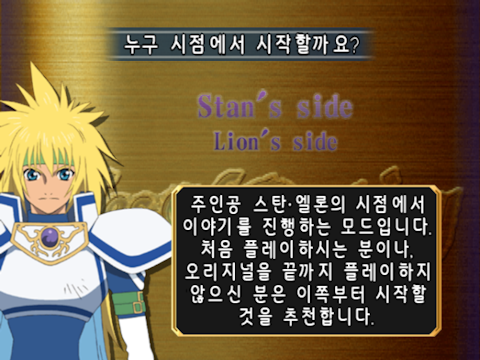
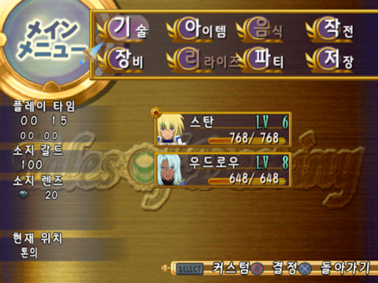
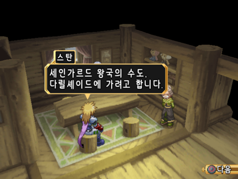
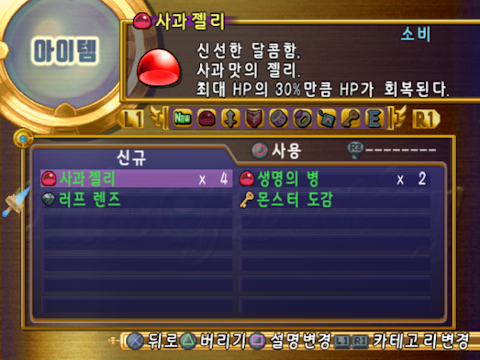
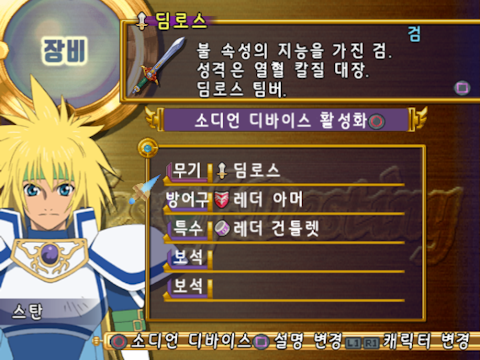
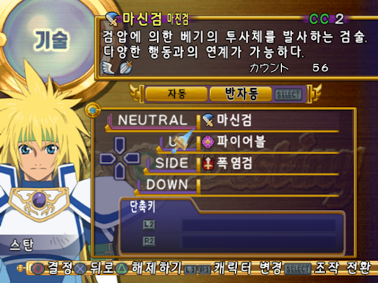
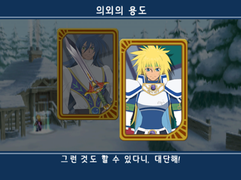

# Tales of Destiny Director's Cut (PS2) 한국어화 패치 (공개 검수 버전)

## 공지

이 프로젝트는 1인 개발로 진행되고 있습니다. 매 변경점마다 공개 검수 버전을 배포합니다.

매 패치의 변경점을 배포하는 이유는 혼자서 검수할 수 있는 양에 한계가 있고, 공개 검수를 통해 더 빠른 완성을 목표로 하기 때문입니다.

게임을 플레이하면서 눈에 보이는 문장의 오류나 버그를 발견하면 [제보](#제보)하거나 [기여](#패치-제작에-참여하기) 해주세요.

- AI 번역은 가끔 실수를 하기도 하고, 미묘한 뉘앙스나 맥락이 필요한 문장은 확인 후 교정이 필요합니다.
- 의성어, 존칭 혼동 같은 번역 오류. 줄바꿈, 오타 등의 표기 오류. 사람 이름이나 지명과 같은 고유명사 표기 오류에 대한 많은 제보 바랍니다.
- 교정과 검수 관련되어 도움을 구하는 이슈는 [🐤 help wanted](https://github.com/ToD-DC-Kor/kor-patch/issues?q=sort%3Aupdated-desc+is%3Aissue+is%3Aopen+label%3A%22%F0%9F%90%A4+help+wanted%22) label이 달린 이슈로 관리되고 있습니다. 관심 있으시면 확인 바랍니다.

## 진행 상황

### 요약

매우 초기 미완성 버전.

시나리오와 아이템은 AI를 통한 기계 번역이 완료되어, 번역 품질에 신경쓰지 않는다면 초반 플레이시 스토리를 이해하는 것은 가능하다고 생각되는 수준. 실제 플레이하면서 이상하게 번역된 문장을 찾아 교정해야 함

### 스크린샷

### 상세

추출된 모든 문자열에 대해서는 AI 기계 번역 완료

- 시나리오 대사
  - 추출: RSCE 100%, SLPS 90%+?
  - 검수: 0%
- 전투 튜토리얼: 0%
- 스킷 자막: 99%
  - 추출: PAK0 100%, PAK1 99%
  - 검수: 0%
- 스킷 제목: 0%
- 영상 자막:
  - 추출: 99%? (불확실)
  - 검수: 0%
- 지명: 0%
- 아이템 설명
  - 추출: 99%
  - 검수: 0%
- 몬스터 도감: 0%
- UI 메뉴
  - 추출: SLPS 99%, PAK 0%
  - 검수: 0%
- 그래픽: ?? (불확실)
  - 메뉴 UI 글자 그래픽: 100%
  - 도감/지도 UI 글자 그래픽: 100%

## 배포 주기 & 다운로드

패치는 갱신이 있을 때마다 수시로 배포.

다운로드는 [Releases 페이지](https://github.com/ToD-DC-Kor/kor-patch/releases)에서 확인. XDelta를 이용하여 원본 ISO에 패치.

## 패치 제작에 참여하기

모든 번역 파일을 공개하고 있기 때문에, GitHub Issue나 Pull Request를 통해 기여할 수 있습니다. [GitHub Pull Request 도움말](https://docs.github.com/ko/pull-requests/collaborating-with-pull-requests/proposing-changes-to-your-work-with-pull-requests/creating-a-pull-request), [GitHub Desktop 설치 도움말](https://docs.github.com/ko/desktop/installing-and-authenticating-to-github-desktop/setting-up-github-desktop).

상세한 것은 [CONTRIBUTING.md](./CONTRIBUTING.md)을 참고하세요.

다음과 같은 방법으로 프로젝트에 기여할 수 있습니다.

- 게임 플레이 후 화면에 잘못 표기되는 번역 문자열 [이슈](https://github.com/ToD-DC-Kor/kor-patch/issues/new/choose) 제보
- 번역 오류/교정 Pull Request(PR) 작성
- 그 외 기여
  - 이슈에서 [🐤 help wanted](https://github.com/ToD-DC-Kor/kor-patch/issues?q=sort%3Aupdated-desc+is%3Aissue+is%3Aopen+label%3A%22%F0%9F%90%A4+help+wanted%22) Label이 달린 항목을 클릭하여 도움이 필요한 이슈를 확인하고 기여해보세요.

## 제보

제보는 이슈를 이용하세요.

- 버그 제보, 번역 오류 제보: <https://github.com/ToD-DC-Kor/kor-patch/issues/new/choose>

## Tools

- [Ghidra](https://ghidra-sre.org/)
- [Ghidra Emotion Engine: Reloaded](https://github.com/chaoticgd/ghidra-emotionengine-reloaded)
- [PCSX2](https://pcsx2.net/) Debugger
- [ImHex](https://github.com/WerWolv/ImHex)
- [XDelta](https://www.romhacking.net/utilities/928/)
- [Tales of Destiny Driector's Cut Tools](https://www.romhacking.net/utilities/1419/)
- forked version of [sceWork](https://github.com/lifebottle/sceWork)
- [Pakcomposer Clone](https://github.com/lifebottle/Tales-of-Destiny-DC/tree/master/pakcomposer)
- Hand-maded tools:
  - SLPS string patcher
  - SLPS string find & extractor
  - ISO Patcher
  - LLM Translator
  - Font image creator
  - Memory address converter
  - Hangul(Korean alphabet) font mapper

## Contributors

- [@kexplo](https://github.com/kexplo/), the maintainer of this translation project.
  - all the work including reverse engineering, translation, programming, etc.
- 퍼스트버튼, support for editing graphic resources.
  - editing the font images, UI graphics.

## Credits

- RangerRus, [Tales of Destiny Driector's Cut Tools](https://www.romhacking.net/utilities/1419/)
  - Thanks to RangerRus for creating this tool. It has become very easy to extract game data.
- Tales of Destiny DC English Translation Team(Life Bottle), [Repository](https://github.com/lifebottle/Tales-of-Destiny-DC).
  - Thanks to the Tales of Destiny DC English Translation Team(Life Bottle). The information they left in the repository has saved me a lot of time.
